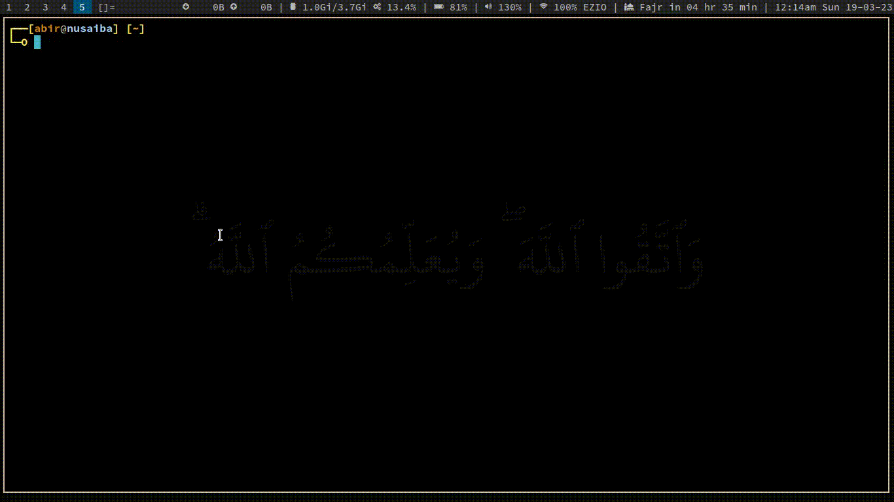

# Cpu_Scheduling_CLI
---

A basic CLI simulator for cpu scheduling algorithms written in `C`. This simulator will help you to visualize `Gantt Chart` along with process information. Tried to make it as beginner friendly as possible both for the user and developer. The algorithms are implemented like the method we use while doing these by pen and paper.

## Folder Structure
---

```
.
├── algos
│   ├── algos.h
│   ├── fcfs.c
│   ├── functions.c
│   ├── rr.c
│   └── sjf.c
├── compile.sh
├── cpu
├── LICENSE
├── main.c
├── process.txt
├── README.md
└── utilities
    ├── colors.h
    ├── cqueue.c
    ├── gantt.c
    ├── input.c
    ├── process.c
    ├── sort.c
    ├── table.c
    └── utilities.h
```


## Compile
---
```bash
git clone https://github.com/eniac00/cpu_scheduling_cli
```
```bash
cd cpu_scheduling_cli
```
```bash
chmod +x compile.sh
./compile.sh
```

## Run
---
```
./cpu <algorithm> <text_file_containing_process_info>
```

## Process text file should contain
---
```code
For non-priority based scheduling

2       ------> total process
P1 0 5
P2 3 8
|  | |
|  | ┕--------> burst time
|  ┕----------> arrival time
┕-------------> process name or ID

----------------------------------------------------------------------
For priority based scheduling

2       ------> total process
P1 0 5 2
P2 3 8 1
|  | | |
|  | | ┕------> priority
|  | ┕--------> burst time
|  ┕----------> arrival time
┕-------------> process name or ID
```

## Tutorial
---
